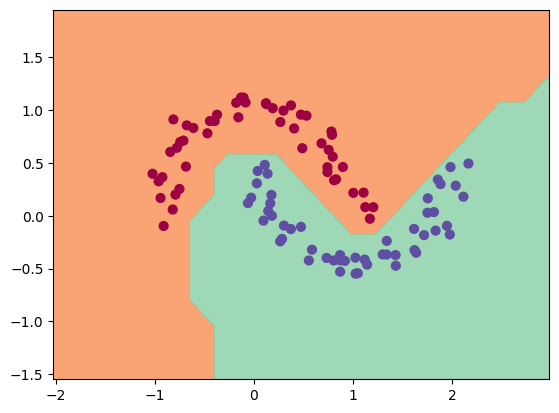

# microjax

A tiny autograd engine following the spirit of Karpathy's [micrograd](https://github.com/karpathy/micrograd/blob/master/README.md). 

Like micrograd, it implements backpropagation (reverse-mode autodiff) over a dynamically built DAG of scalar values and a small neural networks library on top of it. 

Unlike micrograd, which is implemented following PyTorch's OOP API, microjax replicates JAX's functional API. In particular, it exposes the transformation `microjax.engine.grad`. If you have a Python function `f` that evaluates the mathematical function $f$, then `grad(f)` is a Python function that evaluates the mathematical function $\nabla f$. That means that `grad(f)(x1, ..., xn)` represents the value $\nabla f(x_1, \ldots, x_n)$. For univariate functions, `grad` can be applied to its own output to compute higher order derivatives. For example given the mathematical function $g(x)$ and its Python representation `g(x)`, `grad(grad(g))(x)` represents the value $g''(x)$.

In combination with micrograd, microjax could be useful to illustrate the differences between the OOP and functional paradigms. The functional paradigm is characterized by the use of pure functions acting on immutable state, and higher order functions (transformations) that act on pure functions to return other pure functions. These are all apparent in the implementation of microjax, e.g. `f` -> `grad(f)`.

In micrograd, one composes differentiable functions as a succession of operations acting on instances of `Value`, which is micrograd's object to represent nodes in the DAG. Each new operation produces an output that is a new instance of `Value`, aware of its parents and the operation that created it, thus building the computational DAG. Finally, one can call `.backward()` on the output `Value` of the function to compute its gradient with respect to all nodes in the computational DAG. The gradient with respect to a `Value` of name, e.g., `x` is accessed as `x.grad`. 

In microjax, one composes differentiable functions as a succession of operations defined as instances of `Primitive`, which is microjax's object to represent primitive operations that are differentiable and traceable. When `grad(f)` is called, it wraps the function's arguments as instances of `Tracer`, which is microjax's object to represent nodes in the DAG. Then, it evaluates `f` on the traced inputs, generating the computational DAG in the process, and computes the gradient with respect to all nodes in the computational DAG. Finally, it returns the gradient with respect to the input arguments.

### Installation

```bash
pip install microjax
```

### Example usage

Below is a slightly contrived example showing a number of supported operations. It is a replica of micrograd's example, for comparison.

```python
from microjax.engine import grad, relu

def g_fn(a, b):
    c = a + b
    d = a * b + b**3
    c += c + 1
    c += 1 + c + (-a)
    d += d * 2 + relu(b + a)
    d += 3 * d + relu(b - a)
    e = c - d
    f = e**2
    g = f / 2.0
    g += 10.0 / f

    return g

a = -4.0
b = 2.0

g = g_fn(a, b)
dgda, dgdb = grad(g_fn)(a, b)

print(f'{g:.4f}') # prints 24.7041, the outcome of this forward pass
print(f'{dgda:.4f}') # prints 138.8338, i.e. the numerical value of dg/da
print(f'{dgdb:.4f}') # prints 645.5773, i.e. the numerical value of dg/db
```

### Training a neural net

The notebook `demo.ipynb` provides a full demo of training a 2-layer neural network (MLP) binary classifier. This is achieved by initializing a neural net from `microjax.nn` module, implementing a simple svm "max-margin" binary classification loss and using GD for optimization. As shown in the notebook, using a 2-layer neural net with two 16-node hidden layers we achieve the following decision boundary on the moon dataset:



Again, this is a replica of micrograd's demo, for comparison.

The `demo.ipynb` uses additional libraries for visualization and training examples. This project uses [Hatch](https://hatch.pypa.io/latest/) for environment managing and testing. 

If you don't already have hatch installed:
```bash
pip install hatch
```
Then select .venv.default as the kernel when opening `demo.ipynb`.

### Running tests

Tests use [PyTorch](https://pytorch.org/) as a reference for verifying the correctness of the calculated gradients. 

If you have installed hatch, from the root of your repository:
```bash
hatch run test
```

This will:
* Automatically create a virtual environment (if needed),
* Install all development and testing dependencies (including PyTorch),
* Run the test suite using `pytest`.

### License

MIT
